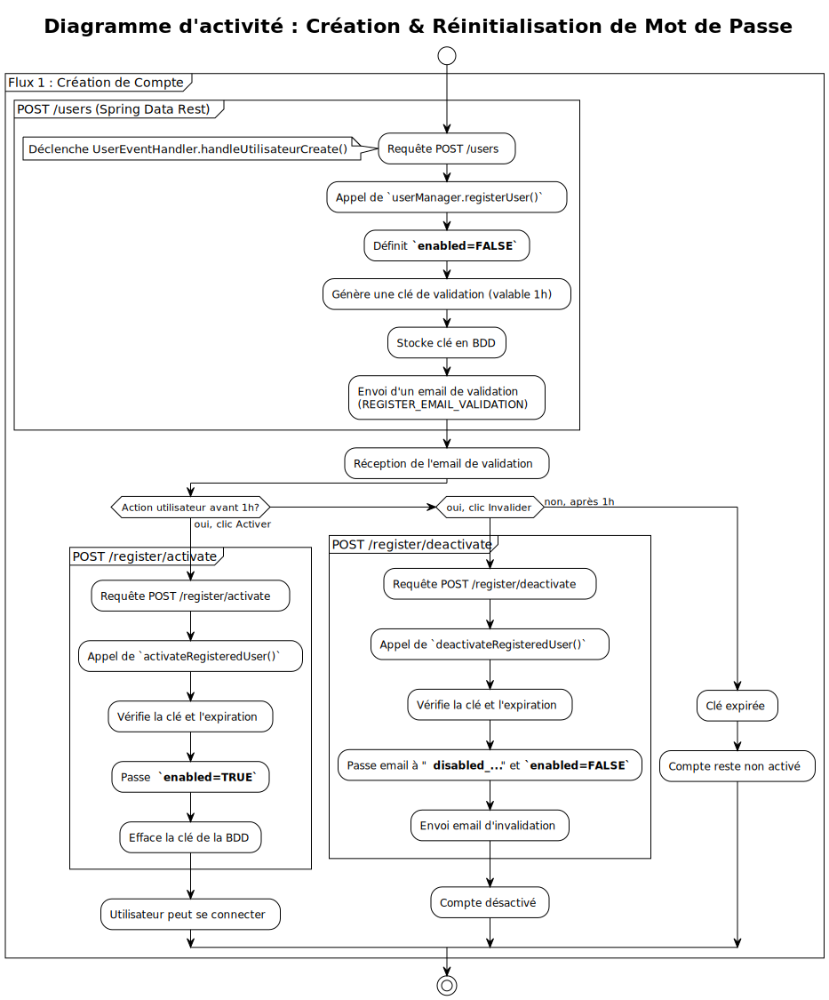
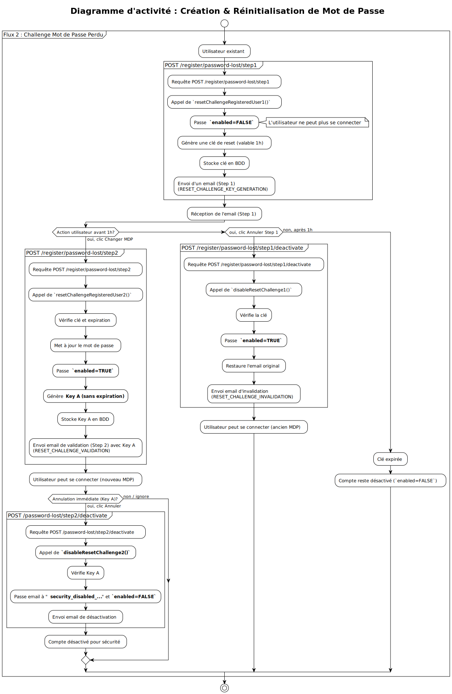

# Jobs
## Tableau de bord de suivi de recherche d'emploi

## Fonctionnalités
- Authentification JWT sécurisée Oauth2
- Gestion des utilisateurs avec rôles (USER, ADMIN)
- CRUD complet des offres d'emploi
- API REST documentée avec Swagger

## Technologies
- Backend: Java 21, Spring Boot 3.x, Spring Security 6.x
- Frontend: Angular, TypeScript
- Database: MySQL
- Build: Gradle
- Deployment: WAR sur Tomcat 10 (à venir)
- Security: JWT, OAuth2 Client Credentials
- Dependencies: GitHub Packages (librairies Loamok)

Url après installation / lancement : [http://localhost](http://localhost)

---

## IMPORTANT : Migration vers GitHub Packages

A partir de cette version, l'application utilise des librairies Java externalisées publiées sur GitHub Packages.

### Pour les NOUVEAUX utilisateurs
Suivez la procédure d'installation normale ci-dessous. Le script `setup-environment.sh` vous demandera vos identifiants GitHub.

### Pour les utilisateurs EXISTANTS
Si vous avez déjà installé une version antérieure de l'application, consultez le 
[Guide de Migration](MIGRATION.md) pour mettre à jour votre installation.

**Migration rapide :**
```bash
cd jobs/conteneurisation
git pull origin master
chmod +x migrate-env.sh
./migrate-env.sh
./build-and-run.sh
```

### Prérequis GitHub

Vous devez disposer de :
1. Un compte GitHub
2. Un Personal Access Token avec le droit `read:packages`

Voir le [Guide de Migration](MIGRATION.md) pour créer votre token.

---

## Installation

### Guide d'installation multi-plateforme

Ce guide explique comment lancer la stack Docker sur **Linux**, **macOS** et **Windows**.

---

#### Prérequis

##### Tous les systèmes
- [Docker Desktop](https://www.docker.com/products/docker-desktop/) installé et en cours d'exécution
- [Docker Compose](https://docs.docker.com/compose/install/) (inclus avec Docker Desktop)
- **NOUVEAU** : Un compte GitHub et un Personal Access Token

##### Alternative sous Linux:
- Démon docker installé et en cours d'éxécution (docker compose reste requis)

##### Windows uniquement
- [Git Bash](https://git-scm.com/downloads) ou [WSL2](https://learn.microsoft.com/windows/wsl/install) pour exécuter les scripts Bash

---

## Étapes d'installation en résumé (démarrage rapide): 

- 1. Cloner le projet
> ```bash
> git clone git@github.com:symio/jobs.git 
> cd jobs/conteneurisation
> ```
- 2. Configurer l'environnement 
> ```bash
> chmod +x *.sh && ./setup-environment.sh
> ```
> Le script vous demandera :
> - Le nom d'instance (ou laissez vide pour utiliser "jobs" par défaut)
> - **Votre nom d'utilisateur GitHub**
> - **Votre Personal Access Token GitHub**
- 3. Lancement
> ```bash
> ./build-and-run.sh
> ```
- 4. Vérification
> Une fois lancé, les services sont disponibles sur :
> 
> - **Backend (API)** : [http://localhost:8080](http://localhost:8080)
> - **Frontend (Angular)** : [http://localhost](http://localhost)
> - **Alternative :** 
>> - **Frontend (Angular)** : http://votre.ip.reseau.local 
>> - (mais pas 127.0.0.1 par exemple 192.468.1.252)
>> - cette adresse vous est donnée par le script de lancement : 
>> ```
>> Stack démarrée avec succès !
>> 
>> Services disponibles :
>>    - Backend:  http://localhost:8080
>>    - Frontend: http://localhost:80, ou http://localhost,
>>    - PgAdmin:  http://localhost:5433
>>    - Mailpit:  http://localhost:8025
>>    - Accès depuis le réseau local: http://192.168.1.252
>> ```

> - **PgAdmin** : [http://localhost:5433](http://localhost:5433) (login et mot de passe  dans votre .env : 
> > - PGADMIN_DEFAULT_EMAIL : Login
> > - PGADMIN_DEFAULT_PASSWORD : Mot de passe

---

##### 1. Cloner le projet
```bash
git clone git@github.com:symio/jobs.git
cd conteneurisation
```

##### 2. Configurer l'environnement

**Option A : Configuration assistée (recommandé)**

```bash
### Linux / macOS
chmod +x setup-environment.sh
./setup-environment.sh

### Windows (Git Bash)
./setup-environment.sh
```

Le script vous demandera :
- Un nom de projet unique (ex: `jobs-dev`, `jobs-test`, `jobs-prod`)
- **Votre nom d'utilisateur GitHub**
- **Votre Personal Access Token GitHub** (voir [Guide de Migration](MIGRATION.md) pour le créer)

**Option B : Configuration manuelle**

Copiez le fichier d'exemple et modifiez-le :

```bash
cp .env.sample .env
```

Éditez le `.env` et /!\ changez obligatoirement `GITHUB_USERNAME` et `GITHUB_TOKEN`.

Les autres valeurs peuvent être laissées par défaut pour un environnement de développement local :

```bash
# .env.sample
COMPOSE_PROJECT_NAME=jobs # ou jobs-test, jobs-prod, etc.

# Spring security jwt key
UNENCODED_KEY='ThisIsADevJwtSecretForLocalTestingOnly12345'
BACKEND_PORT=8080

# URL(s) autorisée(s) pour les requêtes CORS, séparées par des virgules
# Le script build-and-run.sh ajoutera automatiquement l'IP locale à cette liste.
BASE_PROTOCOL=http
BASE_URL=''
BASE_ORIGINS=http://localhost,http://frontend,http://localhost:4200
CORS_ALLOWED_ORIGINS=http://localhost,http://frontend,http://localhost:4200

# Postgresql Environment Variables
DB_HOST=db
POSTGRES_DB=dbname
POSTGRES_USER=dbuser
POSTGRES_PASSWORD='dbuserp@ssw0rd'

# Mailer Environment Variables
SPRING_MAIL_AUTH=true
SPRING_MAIL_STARTTLS=true
SPRING_MAIL_HOST=mailer
SPRING_MAIL_PORT=1025
SPRING_MAIL_USER=jobs@loamok.org
SPRING_MAIL_PASS=MailerP@ssw0rd

# pgAdmin Environment Variables
PGADMIN_DEFAULT_EMAIL=dummyemail@dummy.org # Dummy email but correctly form
PGADMIN_DEFAULT_PASSWORD='d3fault_p@ssw0rd'
PGADMIN_LISTEN_ADDRESS=[::] # Default value
PPGADMIN_LISTEN_PORT=80 # Default value when TLS disabled

## activate the swaggerui docs, set to false in production
SPRINGDOC_ENABLED=true

# github package access (OBLIGATOIRE)
GITHUB_USERNAME=<votre_nom_utilisateur_github>
GITHUB_TOKEN=<votre_token_github>
```

/!\ **Important** : 
- **OBLIGATOIRE** : Renseignez `GITHUB_USERNAME` et `GITHUB_TOKEN` avec vos identifiants GitHub
- Utilisez des **guillemets simples** `'...'` pour les valeurs avec caractères spéciaux
- Changez `COMPOSE_PROJECT_NAME` si vous lancez plusieurs environnements (dev, test, prod) pour isoler les volumes de données

---

#### 3. Lancement

##### Linux / macOS

```bash
# Rendre les scripts exécutables
chmod +x test-encoding.sh encode-env.sh build-and-run.sh init-roles.sh migrate-env.sh

# Tester l'encodage (optionnel mais recommandé)
./test-encoding.sh

# Lancer la stack complète
./build-and-run.sh
```

##### Windows (Git Bash)

1. Ouvrez **Git Bash** (clic droit dans le dossier -> "Git Bash Here")
2. Executez les commandes :

```bash
# Les scripts sont déjà exécutables sous Windows

# Tester l'encodage (optionnel mais recommandé)
./test-encoding.sh

# Lancer la stack complète
./build-and-run.sh
```

##### Windows (WSL2)

```bash
# Même chose que Linux
chmod +x test-encoding.sh encode-env.sh build-and-run.sh init-roles.sh migrate-env.sh
./test-encoding.sh
./build-and-run.sh
```

##### Windows (PowerShell - Alternative)

Si vous ne pouvez pas utiliser Bash, vous pouvez lancer directement :

```powershell
# Encoder manuellement la clé JWT
$UNENCODED_KEY = "ThisIsADevJwtSecretForLocalTestingOnly12345"
$bytes = [System.Text.Encoding]::UTF8.GetBytes($UNENCODED_KEY)
$SPRING_JWT_B64_KEY = [Convert]::ToBase64String($bytes)
echo "SPRING_JWT_B64_KEY='$SPRING_JWT_B64_KEY'" >> .env

# Lancer Docker Compose
docker compose build --no-cache
docker compose up -d
```

---

#### 4. Vérification

Une fois lancé, les services sont disponibles sur :

- **Backend (API)** : http://localhost:8080
- **Frontend (Angular)** : http://localhost:4200
- **PgAdmin** : http://localhost:5433
- **Mailpit** : http://localhost:8025
- **PostgreSQL** : localhost:5432

##### Voir les logs

```bash
# Tous les services
docker compose logs -f

# Un service spécifique
docker compose logs -f backend
docker compose logs -f db-init
```

---

#### Commandes utiles

##### Reconstruire et redémarrer un élément de la stack (exemple: backend)
```bash
export TARGET="backend" ; docker compose down ${TARGET} && docker compose build ${TARGET} &&  docker compose up -d 
```

##### Redémarrer la stack
```bash
docker compose restart
```

##### Arrêter la stack
```bash
docker compose down
```

##### Arrêter et supprimer les volumes (reset complet)
```bash
docker compose down -v
```

##### Rebuild sans cache
```bash
docker compose build --no-cache
docker compose up -d
```

---

#### Troubleshooting

##### "Permission denied" sur Linux/macOS
```bash
chmod +x *.sh
```

##### Les caractères spéciaux ne sont pas encodés correctement
Vérifiez que vous utilisez des **guillemets simples** `'...'` dans le `.env`

##### Docker n'est pas démarré
- **Windows/macOS** : Lance Docker Desktop
- **Linux** : `sudo systemctl start docker`

##### Port déjà utilisé
Changez les ports dans `docker compose.yml` :
```yaml
ports:
  - "8081:8080"  # Backend sur 8081 au lieu de 8080
```

##### Base de données non initialisée
Vérifiez les logs du service `db-init` :
```bash
docker compose logs db-init
```

##### Erreur "Could not resolve org.loamok.libs:..."
Cela signifie que vos identifiants GitHub ne sont pas configurés ou sont invalides.
Consultez le [Guide de Migration](MIGRATION.md) section "Résolution des problèmes".

---

#### Architecture

```
conteneurisation/
├── .env                   # Configuration (ne pas committer !)
├── .env.sample            # Exemple de configuration
├── cleanup.sh             # Nettoyage automatique de l'environnement
├── docker compose.yml     # Orchestration des services
├── DockerFile.backend     # Image du backend Java
├── DockerFile.frontend    # Image du frontend Angular
├── init-roles.sh          # Initialisation des rôles DB
├── encode-env.sh          # Encodage JWT en base64
├── setup-environment.sh   # Configuration automatique de l'environnement
├── migrate-env.sh         # Migration des anciennes installations
├── test-encoding.sh       # Test de l'encodage
└── build-and-run.sh       # Script de lancement complet
```
---

#### Sécurité

- /!\ Ne **jamais** committer le fichier `.env` avec vos credentials (Mots de passes, noms d'utilisateurs, clé non encodée de signature JWT, token GitHub)
- Utilisez `.env.sample` pour partager des exemples
- Générez des mots de passe forts pour la production
- Changez les secrets par défaut
- **NOUVEAU** : Protégez votre token GitHub comme un mot de passe

---

#### Notes

- Les scripts détectent automatiquement votre sytème d'exploitation (Linux, macOS, Windows)
- L'encodage base64 est géré différemment sur macOS vs Linux
- Sur Windows, Git Bash est recommandé pour une meilleure compatibilité
- **NOUVEAU** : Les identifiants GitHub sont nécessaires pour télécharger les dépendances

---

## Challenges de sécurités renforcés

### Création de compte : 



### Mot de passe perdu : 



---

## Notes de Licence

### 1. Documents et éléments graphiques

Tous les documents, images, diagrammes et, de manière générale, **toutes les illustrations créées pour l'application _Jobs_** sont couverts par la licence décrite dans le présent chapitre.  
**Exception :** les logos, marques et noms de logiciels cités demeurent la propriété exclusive de leurs détenteurs respectifs.

#### Licence applicable
L'ensemble de ces éléments est diffusé sous licence **Creative Commons Attribution - Partage dans les Mêmes Conditions 4.0 International (CC BY-SA 4.0)**.  
Licence complète : [https://creativecommons.org/licenses/by-sa/4.0/deed.fr](https://creativecommons.org/licenses/by-sa/4.0/deed.fr)

#### Résumé de la licence
La **CC BY-SA 4.0** autorise toute personne à :

- **Partager** : copier, reproduire, distribuer et communiquer l'œuvre ;  
- **Adapter** : remixer, transformer et créer à partir de l'œuvre,  
- **Y compris à des fins commerciales**,  
- **Sur tout support et par tout moyen**.

#### Obligations associées
Toute utilisation de l'œuvre implique de :

- **Attribuer** l'œuvre à ses auteurs originaux, indiquer la source et signaler les éventuelles modifications ;  
- **Partager dans les mêmes conditions** : toute création dérivée doit être diffusée sous la même licence **CC BY-SA 4.0**, afin de garantir la libre réutilisation et modification.

---

### 2. Code source

Le **code source** des éléments logiciels constituant l'application _Jobs_ est placé sous licence **Open Source GNU General Public License version 3 (GPLv3)**.

#### Résumé de la licence
La **GPLv3** garantit à tout utilisateur le droit de :

- Exécuter, étudier et modifier le code source ;  
- Redistribuer le code original ou modifié ;  
- À condition que toute redistribution soit effectuée sous la même licence **GPLv3**, afin de préserver le caractère libre du logiciel.

Licence complète : [https://www.gnu.org/licenses/gpl-3.0.html](https://www.gnu.org/licenses/gpl-3.0.html)

---

_Ce double régime de licences permet de distinguer clairement les droits applicables aux éléments graphiques (CC BY-SA 4.0) et au code source (GPLv3), tout en assurant une compatibilité et une cohérence avec les principes du logiciel libre._