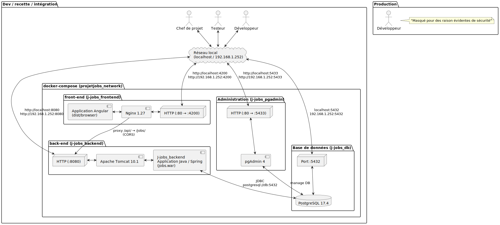
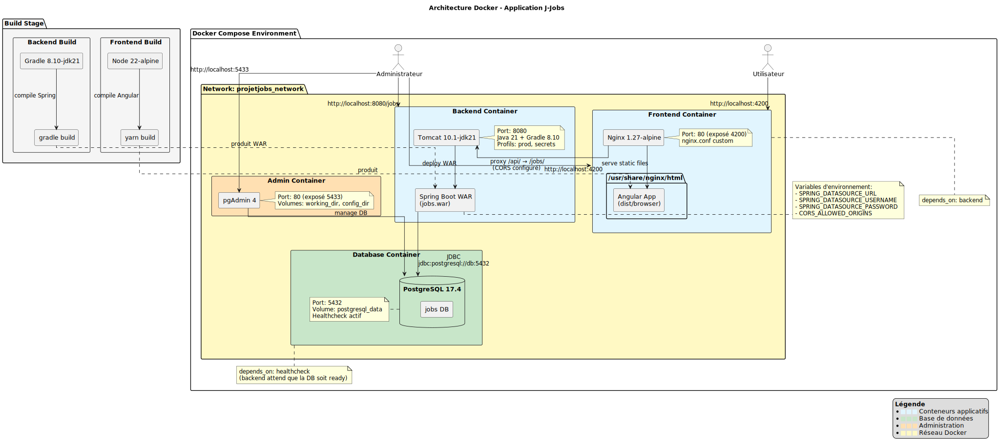
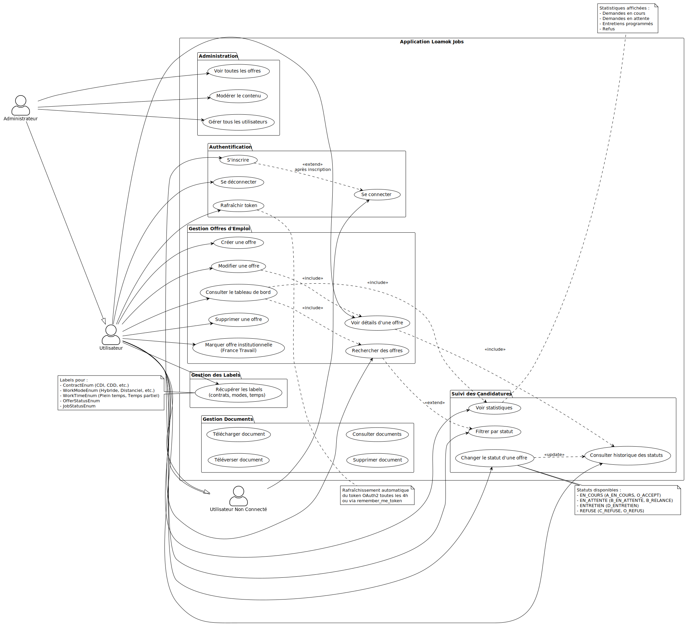
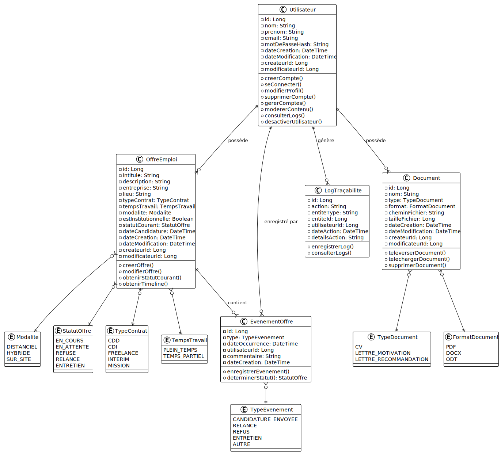
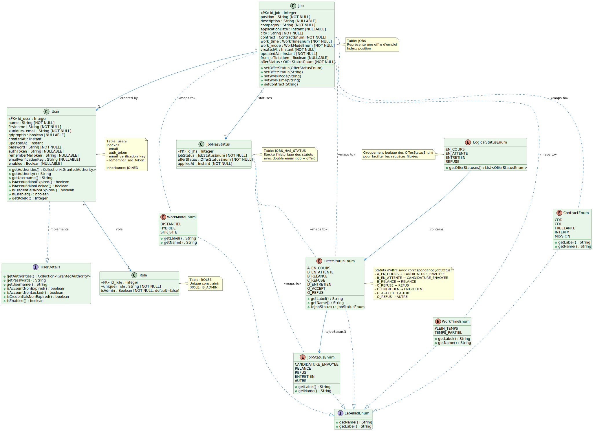
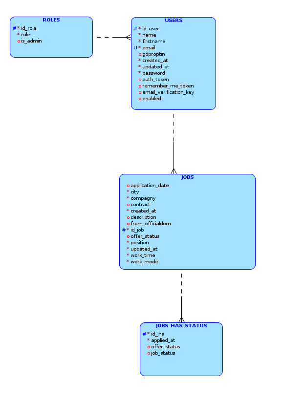
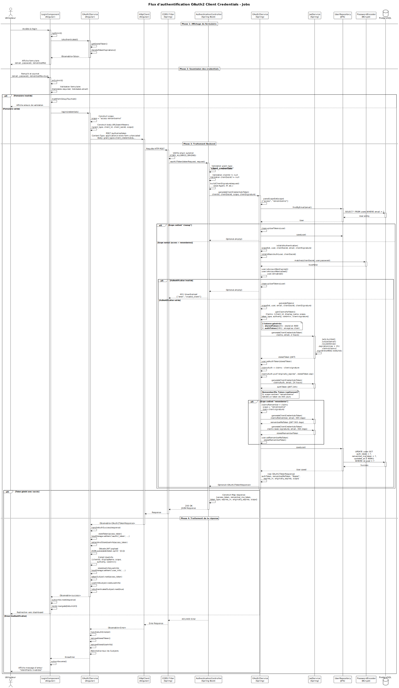

# Application Jobs

## Tableau de bord de suivi de recherche d'emploi

## 🚀Fonctionnalités
- Authentification JWT sécurisée Oauth2
- Gestion des utilisateurs avec rôles (USER, ADMIN)
- CRUD complet des offres d'emploi
- API REST documentée avec Swagger

## 🛠Technologies
- Backend: Java 21, Spring Boot 3.x, Spring Security 6.x
- Frontend: Angular, TypeScript
- Database: MySQL
- Build: Gradle
- Deployment: WAR sur Tomcat 10 (à venir)
- Security: JWT, OAuth2 Client Credentials

## Architecture de l’application Jobs :
### Diagramme UML de composants :

### Diagramme UML de déploiement : 

### Diagramme UML de Use Case :

### Diagramme UML de Classes du domaine :

### Diagramme UML de Classes des entités :

## Modèle logique de données :

## Diagramme UML de séquence Action "Login" :

